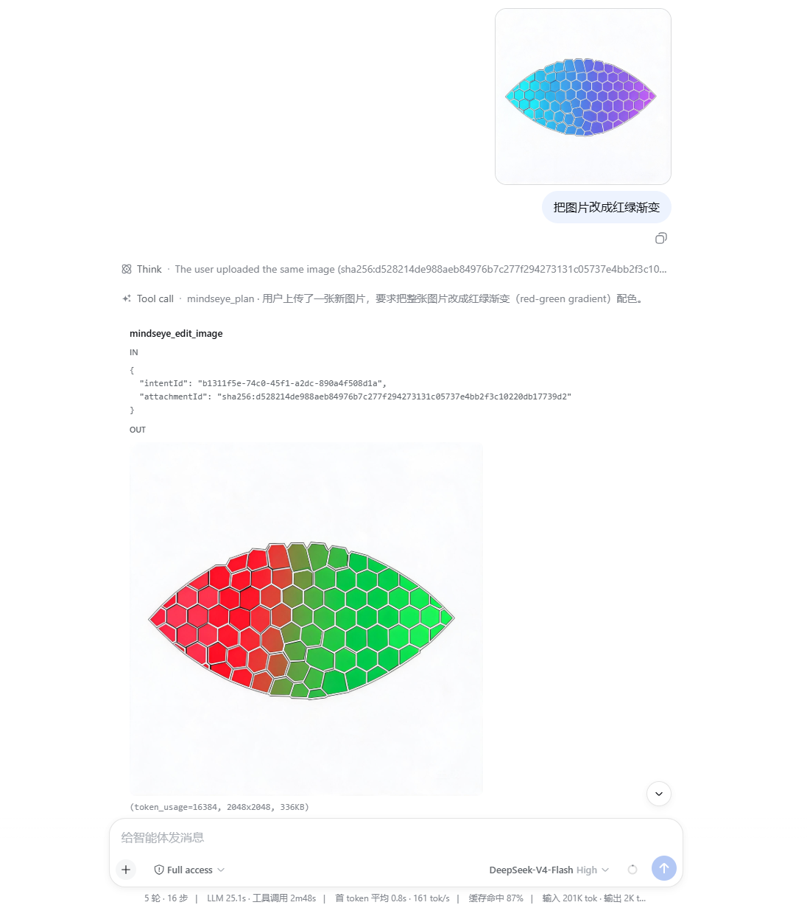

# MindsEye


[](https://www.dsh.so/artifact/dsh-mindseye/)

> Let DeepSeek see images natively — model-driven vision tools for DeepSeek Harness

[English](README.md) | [中文](README.zh-CN.md)

Current version: 0.2.4

MindsEye is a vision plugin for DeepSeek Harness (dsh). Pasted images stay visible in the conversation while DeepSeek keeps reasoning and the vision model does the seeing. The plugin exposes task-specific vision tools that the model selects by intent; each tool maps to a fixed intent and model route, returns structured JSON, and reduces repeated calls through caching and evidence reuse.

## Core Experience

- **Paste and see**: images enter the dsh conversation as native attachments; native multimodal DeepSeek models receive them unchanged, while text-only DeepSeek models keep the same selector entry and use the MindsEye adapter bridge
- **Model picks the intent, plugin routes the model**: `mindseye_read_image` takes an `intent` (visual-qa / ocr / layout / chart / color / pixel-diff / general) plus optional `extract` for combined structured evidence in one call; `mindseye_ground` stays separate for coordinates
- **Generated images appear in the conversation**: `mindseye_generate_image` delegates to a dedicated image generation model and returns the result as a dsh attachment, without auto-saving to the project or running automatic verification
- **Automatic mounting on image turns**: vision tools are registered when an image message arrives; text-only turns keep only one activation entry so tools do not occupy model context permanently
- **Batch reads in one call**: multiple images are read together, with exponential split fallback on batch 4xx so a failure affects only the failed image
- **Route-safe history**: multimodal routes keep image blocks intact; text-only requests receive attachment markers without mutating the durable session surface
- **Every call is transparent**: provider, model, latency, token usage, and fallback markers are returned for auditability



## Implemented Features

### Image Input

- Native paste/drag through dsh without duplicate provider or model entries
- `paste-to-path` fallback only when the adapter bridge is unavailable and the selected model is confirmed text-only
- `mindseye_read_image` general vision, supporting local paths, single attachment ids, and batch attachment ids

### Tools and Routing

| Tool | Intent | Route | Batch |
| --- | --- | --- | --- |
| `mindseye_read_image` | General vision QA + `intent` tasks (ocr / layout / chart / color / pixel-diff / general), optional `extract` for combined evidence | understand / extract per intent | Yes |
| `mindseye_ground` | Target pixel coordinate location | locate | No |

- `understand / extract / locate` model routes are independently configurable and fall back to the general understanding model when unset
- Vision tools auto-mount on image turns; text-only turns keep only `mindseye_vision_activate` so tools do not permanently consume model context
- Structured JSON: `images` / `evidence` / `answer` / `meta`; `meta` includes real token usage, call attempts, and fallback markers
- Exact cache: image sha256 + normalized query + region + baseUrl + model + prompt version; a hit skips the vision model call

### Image Generation

- `mindseye_generate_image(intentId)`: text-to-image through `image.generate`
- `mindseye_edit_image(intentId, attachmentId)`: image-to-image through `image.edit`, sending the reference image to the provider
- Generated results are displayed as dsh attachments with a `(token_usage=..., widthxheight, size)` audit line


### Providers

- OpenAI-compatible Chat Completions and Responses protocols
- `vision.fallbacks` is the recognition-chain fallback list; image generation and editing use the ordered `image.generate` and `image.edit` chains directly
- Image routes expose configurable `endpoint`, `bodyMode` (`json` or `multipart`), and `imageField` for provider compatibility
- Multi-image batch calls with exponential fallback (batch 4xx retries by halving; `locate` does not support batch)

### Memory

- Image-level hard facts are persisted by sha256, with evidence evicted by capacity LRU (default 1000 entries)
- Soft memory uses BM25 retrieval of historical Q&A injected as context, evicted by capacity (default 1000 entries)
- `mindseye_memory_put / get / search / diff` are exposed as dsh tools; calls are visible in the session and audited

### Data Handling and Security

- **Native attachments first**: image-capable models keep native dsh attachments; MindsEye associates images by attachment id and does not ask the user to choose local files manually
- **Automatic temporary path fallback**: if the adapter bridge is unavailable and the current model is confirmed text-only, freshly pasted or dropped PNG, JPEG, WebP, or GIF files (up to 25 MiB each) are validated, stored in an isolated system temp directory, and returned as paths. Temp files use `0600` mode
- **External vision calls**: image bytes and question text are sent only to the vision provider's Base URL when a MindsEye tool executes; configure only services you trust
- **Credentials and cache**: API keys resolve from environment variables, dsh Credentials, or plugin settings and are sent as Bearer auth to the matching provider only. The exact cache lives only in the current dsh process memory (max 500 entries), is never persisted, and clears on process exit
- **Execution boundary**: the plugin never starts shells, child processes, or executes downloaded code. The normal web paste fallback only reads the temporary image just created by the plugin; tools also accept dsh attachment ids

### dsh Web Settings Card

- `understand / extract / locate` routes can be added as needed; unset routes fall back to the default model
- Base URL, API key (masked with eye toggle), model id, protocol (explicit), and common Max Tokens values
- The DeepSeek bridge decorates the existing `deepseek-official` route in place: the selector keeps one provider and one copy of each model, native image models pass through unchanged, and text-only requests are sanitized only at the adapter boundary

## Installation

```sh
npx @deepseek-ai/dsh plugin --profile web add dsh-mindseye
```

Restart dsh web after installation. The adapter bridge is automatic and has no user-facing switch; a failed bridge restores the official adapter and enables the path fallback.

On first use, configure one general vision model (Base URL, API key, model id) in the MindsEye settings card; unconfigured OCR / locate routes fall back to the general model automatically.

## Development

```sh
pnpm install
pnpm test
pnpm typecheck
pnpm build
```
