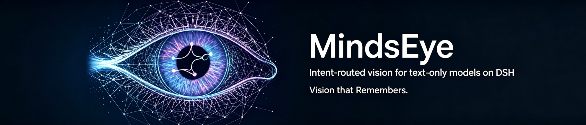

# MindsEye



[](https://www.dsh.so/artifact/dsh-mindseye/)

> 面向 DeepSeek Harness 的意图驱动视觉、生图和可视浏览器自动化插件。

[English](README.md) | [中文](README.zh-CN.md)

当前版本：0.2.7

MindsEye 是 [DeepSeek Harness](https://github.com/haiziyao/dsh) 的插件，为纯文本模型提供图片理解、图片生成和可选的浏览器自动化能力，同时保留 DSH 会话作为主要用户交互界面。

## 核心能力

### 图片理解

- 保留 DSH 原生图片附件，不要求用户手动选择本地文件。
- 图片轮自动挂载视觉工具；纯文本轮只保留一个激活入口，需要看图时再挂载。
- `mindseye_read_image` 支持通用视觉问答，以及 OCR、布局、图表、颜色和像素差异等专项任务。
- `mindseye_ground` 返回目标在原图中的像素边界框，可用于点击、裁剪等后续操作。
- 支持单图和多图读取，并返回图片、证据、答案和调用元数据等结构化结果。

### 图片生成与编辑

- `mindseye_generate_image` 将用户的生图要求发送到已配置的生图路由。
- `mindseye_edit_image` 将 DSH 图片附件和编辑要求发送到已配置的图像编辑路由。
- 生成图片以 DSH 原生附件形式返回，并直接显示在会话中。
- 生图不会自动保存到项目，也不会自动执行回验。

### 浏览器自动化

启用 `gui.enabled` 后，MindsEye 会打开独立的可见 Chrome 或 Edge 浏览器会话。GUI 工具支持打开页面、截图、等待、点击、输入、按键、滚动和关闭会话。

遇到验证码、登录或权限确认时，任务会暂停在 DSH 原生提问卡片上。用户可以：

- 接管可见浏览器并完成操作；
- 如果验证可能已经完成，跳过第一页交接问题；
- 放弃当前任务。

用户选择继续后，MindsEye 会重新检查页面状态，确认恢复后再把控制权交还给模型。浏览器使用独立会话，不接管用户已有的 Chrome 或 Edge profile。每次浏览器动作后都必须重新截图，避免继续使用已经失效的元素引用或坐标。

## 工具

| 工具 | 用途 |
| --- | --- |
| `mindseye_plan` | 提取当前用户要求，并准备后续工具使用的意图上下文。 |
| `mindseye_read_image` | 回答一张或多张图片的问题，并提取专项视觉证据。 |
| `mindseye_ground` | 定位目标并返回像素边界框。 |
| `mindseye_generate_image` | 根据用户要求生成图片。 |
| `mindseye_edit_image` | 编辑用户提供的图片附件。 |
| `mindseye_vision_activate` | 在纯文本轮挂载视觉工具。 |
| `mindseye_gui_open` / `snapshot` / `wait` | 打开浏览器会话并观察当前页面。 |
| `mindseye_gui_click` / `type` / `keypress` / `scroll` | 执行带页面状态校验的浏览器动作。 |
| `mindseye_gui_close` | 关闭当前浏览器会话。 |

记忆工具是可选的，提供显式的 DSH 操作，用于存储、读取、搜索和比较图片相关记录。

## 配置

可以通过 DSH 设置卡或插件配置管理 MindsEye。

- `vision.routes`：分别配置 `understand`、`extract` 和 `locate` 路由。
- `vision.fallbacks`：视觉调用的备用路由。
- `image.generate`：有序的图片生成路由。
- `image.edit`：有序的图片编辑路由。
- `gui.enabled`：启用可见浏览器工具，默认关闭。
- `gui.browser`：`auto`、`chrome` 或 `edge`。
- `gui.restrictHosts`：设为 `true` 时启用主机白名单。
- `gui.allowedHosts`：启用白名单后允许访问的主机。
- `gui.maxSteps` 与 `gui.timeoutMs`：单次浏览器运行的步数和超时限制。

视觉路由支持 OpenAI-compatible Chat Completions 或 Responses API。图片路由支持 JSON 和 multipart 请求体，可以独立配置不同的图片服务商。

## 数据与安全

- 支持图片的模型继续接收 DSH 原生图片块；纯文本降级路径只使用当前粘贴操作创建的隔离临时文件。
- 只有 MindsEye 工具实际调用视觉服务商时，图片字节和问题内容才会发送给对应服务商。
- 凭据来自 DSH Credentials、环境变量或插件设置，并只发送给匹配的服务商。
- 只有明确启用浏览器自动化时，插件才会启动本地 Chrome 或 Edge 子进程；它不使用用户现有浏览器 profile，也不执行下载后的代码。
- 浏览器访问可以限制为明确配置的主机白名单。

## 安装

```sh
npx @deepseek-ai/dsh plugin --profile web add dsh-mindseye
```

安装后重启 DSH Web，然后在 MindsEye 设置卡中至少配置一条视觉路由。未配置的专项视觉路由在有可用通用理解路由时会自动回退。

## 开发

```sh
pnpm install
pnpm test
pnpm typecheck
pnpm build
```
